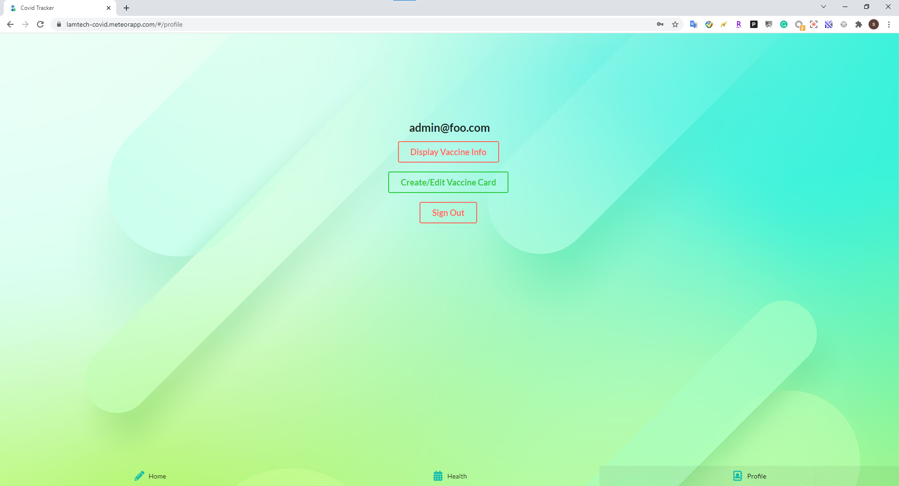

# COVID Checker

## Table of Contents
* [Overview](#overview)
* [Covid Checker](#covid-check)
* [User Manual](#user-manual)
* [The Team](#the-team)

## Overview
This is the first project for our ICS 491 which help us to prepare hackathons.

## Covid Checker

Covid Checker is an application which record each user's daily health condition. which user
are able to create account and login Covid Checker for daily health condition check. The database
will be able to record every day's health condition and to determined if they are safe to attend to 
school or not. The site is currently deployed in [here](https://lamtech-covid.meteorapp.com/#/).

## User Manual

### Landing page

This is the landing page of our application, which allows user to sign up an account or login with exists account.

### Sign up & Sign in pages

For sign up page, it allows user to create an account to login, and the sign-in page allow user to login.

### Home page

After user login, it leads user to home page where user can click check "Check for Symptoms" for daily health status check.
And there will be a form pops out and ask user of their symptoms.

### History page

In the middle of the footer bar, this is the history page which record user's past history of their health symptoms.

### Profile page

The profile page shows user's name in the middle, and you can add or edit your vaccine card by click edit vaccine card, or log out.

### Vaccine card

In you profile page, you can add your vaccine card in to your profile by click the bottom, which you can enter all your vaccine card information.

### Display information

In profile page, if you click on the display information bottom, it will show the vaccination card that you enter with the image.

## The Team
- [Yiwen Chen](https://github.com/yiwenc22)
- [Chak Hon Lam](https://github.com/chakhon)
- [Shengton Jin](https://github.com/ShengT-Jin)
- [Zheng He](https://github.com/Zheng-Chen-He)
